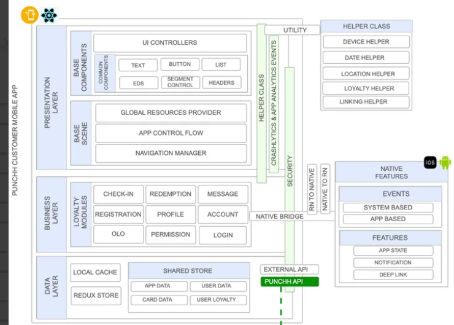
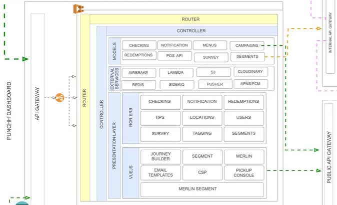

<style>
  section {
   font-family: 'Roboto', 'Segoe UI', 'Liberation Sans', 'Helvetica', 'Arial', sans-serif;}
  h1 {font-size:26pt;}
  h2 {font-size:22pt;}  
  h3 {font-size:20pt;}
  h4 {font-size:16pt;}
  h5 {font-size:10pt;}
  p,li {font-size:14pt;}
  footer {font-size:14pt;text-indent:48px}
</style>

# Notes to my future self V3, 
### [_public edition_][swyx] by [Marc J. <span style="color:darkgreen;">Green</span>berg](mailto:marc@codemarc.net) (marc@codemarc.net)

<br/>

NTMFS is essentially a blog. As once explained by the architect in the [matrix reloaded][redux] this is not the first version of NTMFS.  

#### [Robot Monkey Butler][rmb]

This time It will take on a presentation wiki flavor where each topic can be thought of as a presentable subject. As I document my discoveries and share them in prose, I expect to create a [learning in public][swyx] environment. I am very exciting ( ͡° ͜ʖ ͡°) to get started.

Additionally this work is essentially about building evolutionary architectural thought framing around technological developments. It is expected to often morph and occasionally pivot and we iterate and evolve our understanding of things

<footer>See: the <a href="#tools">tools we use</a></footer>

<!-- References -->
[swyx]: https://www.swyx.io/learn-in-public/
[rmb]: https://fb.watch/9P1cHyeIXJ/
[redux]: https://youtu.be/LN8EE5JxSGQ?t=86

---

# April 2022

| Sun | Mon | Tue | Wed | Thu | Fri | Sat |
| --- | --- | --- | --- | --- | --- | --- |
|     |     |     |     |     | 01  | 02  |
| 03  | 04  | 05  | 06  | 07  | 08  | 09  |
| 10  | 11  | 12  | [13]| [14]| [15]| 16  |
| 17  | 18  | 19  | 20  | 21  | 22  | 23  |
| 24  | 25  | 26  | 27  | 28  | 29  | 30  |

  
##### 3/13 [restart/reboot/redux][13]
##### 3/14 [teams names][14]
##### 3/15 [punchh me][15]


<!-- References -->
[13]: #20220413
[14]: #20220414
[15]: #20220415

---

### Tools used with NTMFS <a id="tools">

- [Marp][t1] - Markdown Presentation Ecosystem
- [Mermaid][t4]- Generation of diagrams and flowcharts from text in a similar manner as markdown.
- [Visual Studio Code][t0] with plugins: [Marp for VS Code][t2], [Mermaid+Draw.io][t3]

<footer><b>Note: </b>./.vscode/extensions.json lists recommended plugins for NTMFS

<!-- References -->
[t0]: https://code.visualstudio.com/
[t1]: https://marp.app/
[t2]: https://marketplace.visualstudio.com/items?itemName=marp-team.marp-vscode,
[t3]: https://marketplace.visualstudio.com/items?itemName=nopeslide.vscode-drawio-plugin-mermaid
[t4]: https://unpkg.com/mermaid@0.5.2/exdoc/index.html

---
<style>
h4 {font-size:11pt;font-style:italic;margin-top:-3px}
p {font-size:11pt;margin-bottom:12px;}
</style>


### <a id="20220413">Restart / Reboot / Redux </a>
#### Wed April 13th, 2022 09:00am ET

Its been a while since I posted an NTMFS entry and I am not sure why that is. Maybe because I am busy with my new job mapping out my onboarding journey at [Par Tech][pt1]. As a newbie navigating the waters of a new organization I have decided keep a completely open mind about all things **par** and **tech** and I attempt to join the party. 

There is so much I have learned in the last week, some of which is recorded my writing journal, some in slack, some from confluence and some from direct conversations with specific individuals that were listed in my meet and learn document supplied out CTO. Perhaps I need to say my role is the chief of staff in the office of the CTO (Octo), as such it make sense to reach out and actually meet the staff. 


Before you ask, of course I created my chrome extension holding the links I discovered. This one is called parlinks, and you can contact me at marc_greenberg@partech.com to request access.


<!-- References -->
[pt1]: https://www.partech.com/

---

<style scoped>
  h4 {font-size:11pt;font-style:italic;margin-top:-3px}
  p {font-size:11pt;margin-bottom:12px;}
  ol,li {font-size:11pt;}
  hr {margin-top:40px}
</style>

### Branching Strategy
#### Wed April 13th, 2022 12:00 ET

Sat thru an interesting conversation on git branching strategy. It is sad to see the same topics that have been under discussion in every software company over the past 5 years are still under discussion. Good conclusion reached today. 

#### Action Items:  

1. Switch to a pure trunk based branching strategy.
2. Remove wildcard package version references. (maybe enforce this by policy).
3. Document the actual flow and policies.

<hr/>

### Cheers Governor 
#### Wed April 13th, 2022 02:00 PM ET

A few days ago Steve and I began a discussion on the concept of governance, guardrails and guiderails with respect to major technology choices (software, frameworks, databases, etc) across Par.


---
### Cheers Governor (continued) 
#### Wed April 13th, 2022 02:00 PM ET

I have been spelunking thru the punchdev instance of confluence and I found a name associated with lots of architectural content: Who is  andrew berry?

Well it turns out that andrew was an architect from Australia, working with Guarish Sharma who wrote a good number of process documentation. 

* [Preferred Patterns and Platforms][P1]
* [Architecture Pattern Glossary][P2]
* [Software Architecture][P3]
* [Platform Architecture][P4]
* [Integration Architecture][P5]


<!-- References -->
[P1]: https://punchhdev.atlassian.net/wiki/spaces/ENGINEERIN/pages/91914332/Preferred+Patterns+and+Platforms
[P2]: https://punchhdev.atlassian.net/wiki/spaces/ENGINEERIN/pages/80838716/Architecture+Pattern+Glossary
[P3]: https://punchhdev.atlassian.net/wiki/spaces/ENGINEERIN/pages/58622860/Software+Architecture
[P4]: https://punchhdev.atlassian.net/wiki/spaces/ENGINEERIN/pages/58589889/Platform+Architecture
[P5]: https://punchhdev.atlassian.net/wiki/spaces/ENGINEERIN/pages/59179024/Integration+Architecture

---

<style>
  h1 {font-size: 28pt;top:222px;}
  table {
    margin-top:-2px;
      width:100%;
   font-family: 'Roboto', 'Segoe UI', 'Liberation Sans', 'Helvetica', 'Arial';
   font-size: 14pt;
  }
</style>   


### <a id="20220414">Brink Teams</a>
#### Wed April 14th, 2022 09:00am ET


Group         | Team     | Assignment
--------------| -------  | ------------------
API Platform  | Banzai   | Services and Data
Architecture  | | 
BMS           | Upgrade Night Angels | Instore (Register/Kitchen/BMS)
In-Store      | Rowdy Rebels  | Instore-1 (Register/Kitchen)
ㅤ            | Rebel Fleet   | Instore-2 (Register/Kitchen)
ㅤ            | Rebel Scrum   | Instore-3 (Register/Kitchen)
Integrations  | Federal Bureau of Integrations | Integrations-1
ㅤ            | Central Integrations Agency    | Integrations-2
Microservice  | Poggers       | MicroServices
ㅤ            | Asgardians    | MicroServices-2ㅤ            
Payments      | Money Heist   | Payments
Regression    | Advengers     | Regression
Services and Data      | Hypermatter Reactor    | Services and Data 
Web           | Nerf Herders | Admin Portal / CP / CPM
ㅤ            | Vaporware    | Admin Portal / CP/ CPM


---
<style scoped>pre { margin-top:-3px;font-size:12t;}</style>

### <a id="20220415">Building Punchh Server Redux</a>
#### Fri April 15th, 2022 04:00 PM ET

Even though I have already built the Punchh server once, I am ready to try this again. This time I am specifically looking at tools and tech choices. My build environment is windows but more specifically, it is wsl2 (Windows Subsystem for Linux Distributions) and ubuntu

```bash
c:\> wsl -l
Windows Subsystem for Linux Distributions:
Ubuntu (Default)
docker-desktop
docker-desktop-data

c:\> cd par\punchh\punchh-server & bash

$ cat /proc/version
 Linux version 5.10.102.1-microsoft-standard-WSL2 (oe-user@oe-hostx86_64-msft-linux-gcc (GCC) 
 9.3.0, GNU ld (GNU Binutils) 2.34.0.20200220) 
 #1 SMP Wed Mar 2 00:30:59 UTC 2022

$ lsb_release -irc
Distributor ID: Ubuntu
Release:        20.04
Codename:       focal

$ git config core.eol lf
$ git config core.autocrlf input

$ sudo make init
```

---
## observations

The one constant we know is that we are living with constant change. And the more things change the more they stay the same. I ran into the typical window vs linux, CRLF vs LF issue, and fixed it using the global config git commands (see above).  

One of the scripts misidentified the location of the hosts file (line 133 of addhost.sh) in my environment, a easy fix and off we go.

### punchh-server dependencies

component         | tool                                                                  | brief
----------------  | -----                                                                 | -----------------
containers        | redis                                                                 | docker-compose.yml
ㅤ                | mysql 5.7                                                             | docker-compose.yml
ㅤ                | rails                                                                 | docker-compose.yml
ㅤ                | ruby  2.6.6                                                           | Dockerfile.development
gems (of interest)| [airbrake](https://rubygems.org/search?query=airbrake)                | error and perf monitoring https://airbrake.io/
ㅤ                | [mongoid](https://rubygems.org/search?query=mongoid)                  | ODM (Object Document Mapper) for MongoDB
ㅤ                | [timber](https://rubygems.org/search?query=timber)                    | logging Made Easy
ㅤ                | [dotenv](https://rubygems.org/search?query=dotenv-rails)              | env manager
ㅤ                | [mutex](https://rubygems.org/search?query=redis-mutex)                | distributed mutex using Redis
ㅤ                | [puma](https://rubygems.org/search?query=puma)                        | threaded, and highly parallel HTTP 1.1 server

---

component         | tool                                                                  | brief
----------------  | -----                                                                 | -----------------
ㅤ                | [elasticsearch](https://rubygems.org/search?query=elasticsearch-model)| elastic search 
ㅤ                | [2fa](https://rubygems.org/search?query=two_factor_authentication)    | 2fa for device
ㅤ                | [mysql2](https://rubygems.org/search?query=mysql2)                    | mysql library (bound to libmysql)
ㅤ                | [newrelic](https://rubygems.org/search?query=newrelic_rpm)            | new relic apm for ruby
ㅤ                | [scout](https://rubygems.org/search?query=scout_apm)                  | https://scoutapm.com/
ㅤ                | [sfmc](https://rubygems.org/search?query=sfmc-fuelsdk-ruby)           | [Salesforce Marketing Cloud Platform](https://github.com/sachin/FuelSDK-Ruby.git')
ㅤ                | [oktakit](https://rubygems.org/search?query=oktakit)                  | Okta API
ㅤ                | [bullet](https://rubygems.org/search?query=bullet)                    | query optimizer
ㅤ                | [remotipart](https://rubygems.org/search?query=remotipart)            | remote multipart forms
ㅤ                | [rack-attach](https://rubygems.org/search?query=rack-attack)          | hack attach mitigation
ㅤ                | [twilio](https://rubygems.org/search?query=twilio-ruby)               | twilio rest api, twiml, twilio jwt
ㅤ                | [whenever](https://rubygems.org/search?query=whenever) | cron job interface
payments          | [hps](https://rubygems.org/search?query=hps)                          | heartland payment systems for processing payments via portico gateway
ㅤ                | [braintree](https://rubygems.org/search?query=braintree)              | braintree global payment platform
ㅤ                | [andriod pay](https://rubygems.org/search?query=google-api-client)    | andriod pay
ㅤ                | [apple pass](https://rubygems.org/search?query=passbook)              | apple passbook

---

component         | tool                                                                  | brief
----------------  | -----                                                                 | -----------------
aws               | [core](https://rubygems.org/search?query=aws-sdk-core)                | [AWS SDK for Ruby - Version 3](ttps://github.com/aws/aws-sdk-ruby#aws-sdk-for-ruby---version-3)
ㅤ                | [s3](https://rubygems.org/search?query=aws-sdk-s3')                   |
ㅤ                | [lambda](https://rubygems.org/search?query=aws-sdk-lambda)            |
ㅤ                | [dynamodb](https://rubygems.org/search?query=aws-sdk-dynamodb)        |
ㅤ                | [secretsmanager](https://rubygems.org/search?query=aws-sdk-secretsmanager) |
ㅤ                | [AmazonMWAA](https://rubygems.org/search?query=aws-sdk-mwaa)          |
Auth              | [devise](https://rubygems.org/search?query=devise)                    | authentication solution
ㅤ                | [omniauth](https://rubygems.org/search?query=omniauth)                | multiple-provider authentication
ㅤ                | [doorkeeper](https://rubygems.org/search?query=doorkeeper)            | oauth2 provider
ㅤ                | [dalli](https://rubygems.org/search?query=dalli)                      | high performance memcached client
ㅤ                | [idp](https://rubygems.org/search?query=saml_idp)                     | SAML IdP (Identity Provider) Library
ㅤ                | [saml](https://rubygems.org/search?query=ruby-saml                    | SAML toolkit
ㅤ                | [recaptcha](https://rubygems.org/search?query=recaptcha)              | captcha tools

---

component         | tool                                                                  | brief
----------------  | -----                                                                 | -----------------
social            | [ommniauth-fb](https://rubygems.org/search?query=omniauth-facebook)   | omniauth strategy for facebook
ㅤ                | [messenger](https://rubygems.org/search?query=facebook-messenger)     | facebook messenger client
ㅤ                | [koala](https://rubygems.org/search?query=koala)                      | facebook graph client
ㅤ                | [omniauth-twitter](https://rubygems.org/search?query=omniauth-twitter)| omniauth strategy for twitter
ㅤ                | [twitter](https://rubygems.org/search?query=twitter)                  | twitter api
more uncat gems   | [pdf](https://rubygems.org/search?query=wicked_pdf)                   | inline pdf generation
ㅤ                | [applepush](https://rubygems.org/search?query=apnotic)                | Apple Push Notifications using the HTTP-2 specifics.
ㅤ                | [fcm](https://rubygems.org/search?query=fcm)                          | firebase cloud messaging
ㅤ                | [png](https://rubygems.org/search?query=chunky_png)                   | png reader/writer
ㅤ                | [qr codes](https://rubygems.org/search?query=rqrcode)                 | qr code generation
ㅤ                | [bar codes](https://rubygems.org/search?query=barby)                  | bar code generation
ㅤ                | [zip/unzip](https://rubygems.org/search?query=rubyzip)                | read write zipfliles
ㅤ                | [vault](https://rubygems.org/search?query=vault)                      | client for HashiCorp vault
ㅤ                | [kafka](https://rubygems.org/search?query=ruby-kafka)                 | Kafka distributed commit log
ㅤ                | [avro](https://rubygems.org/search?query=avro_turf')                  | Avro serialization 

--- 

component         | tool                                                                  | brief
----------------  | -----                                                                 | -----------------
ㅤ                | [ftps](https://rubygems.org/search?query=double-bag-ftps)             | ftps protocol support
ㅤ                | [sftp](https://rubygems.org/search?query=fun_sftp)                    | sftp protocol support
ㅤ                | [geocoder](https://rubygems.org/search?query=geocoder)                | geocode utility
ㅤ                | [cloudinary](https://rubygems.org/search?query=cloudinary)            | image utility https://cloudinary.com/
ㅤ                | [slack](https://rubygems.org/search?query=slack-notifier)             | slack notification
ㅤ                | [hiredis](https://rubygems.org/search?query=hiredis)                  | hiredis (serial/deserial)-ization and blocking I/O)
ㅤ                | [redis](https://rubygems.org/search?query=redis)                      | redis api
ㅤ                | [sendgrid](https://rubygems.org/search?query=sendgrid-actionmailer)   | https://sendgrid.com/docs/API_Reference/api_v3.html
ㅤ                | [mailchimp](https://rubygems.org/search?query=mailchimp-api)          | https://mailchimp.com/developer/tools/
ㅤ                | [mail](https://rubygems.org/search?query=mail)                        | all types of internet mail


---

Punch Client





---

Punch Server


